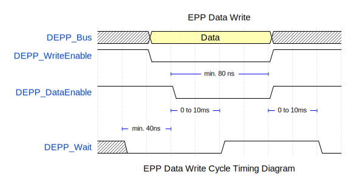
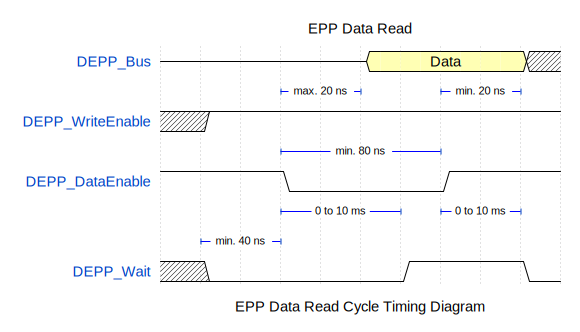

# VHDL Module for the Digilent Asynchronous Parallel Port Interface (DEPP)

## Overview

The `DEPP.vhd` module is designed as an Enhanced Parallel Port (EPP) interface for use with Digilent FPGA boards. It facilitates communication between a host computer and the FPGA via the Digilent Adept software, supporting operations such as address write, data write, and data read cycles.

## Features

- Designed for integration with Digilent FPGA boards.
- Supports data transfers with Digilent Adept software.
- Measured data rate of approximately 4.68 kByte/s.

## Bus Cycles Visualized

- EPP Address Write Cycle
  

- EPP Data Write Cycle
  

- EPP Data Read Cycle
  

## Port Definitions

| Port Name        | Direction | Type        | Description                                        |
| ---------------- | --------- | ----------- | -------------------------------------------------- |
| CLK              | in        | std_logic   | Clock signal. Rising edge triggered.               |
| CE               | in        | std_logic   | Chip enable. `1` = enabled, `0` = disabled.        |
| RST              | in        | std_logic   | Reset signal. `1` = reset, `0` = normal operation. |
| EPP-Interface    | out       | Virtual bus | EPP Interface for address and data operations.     |
| FIFO-Data-Out    | out       | Virtual bus | FIFO compatible data and address output interface. |
| FIFO-Data-In     | in        | Virtual bus | FIFO compatible data input interface.              |
| FIFO-Address-Out | out       | Virtual bus | FIFO compatible request address output interface.  |

Detailed information on virtual bus port configurations can be found within the [module's documentation](docs/DEPP/DEPP.md).

## Dependencies

The module depends on standard logic and numeric libraries available in VHDL. Ensure you have the latest version of the Digilent Adept software for proper interfacing with the module.

## Contributing

Contributions to improve the module or extend its capabilities are welcome. Please adhere to the existing coding standards and provide documentation for any changes made.

## License

This module is open source and is distributed under the MIT license. Please see the [LICENSE](LICENSE) file for full details.

## Acknowledgments

Special thanks to the Digilent team for providing a reference manual in which the diagrams and the description in the text are contradictory ;-)
