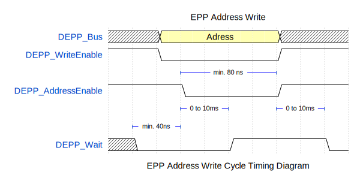

# Entity: DEPP 
- **File**: DEPP.vhd

## Diagram

## Description

An EPP interface for Digilent FPGA boards
This interface is designed to be used with the Digilent EPP interface
and the Digilent Adept software.

 

## Generics

| Generic name  | Type    | Value | Description                                                        |
| ------------- | ------- | ----- | ------------------------------------------------------------------ |
| RegisterQuant | integer | 1     | Number of 8-bit registers  `DOut` and `DIn` are 8 times this width |

## Ports

| Port name     | Direction | Type                                               | Description                                       |
| ------------- | --------- | -------------------------------------------------- | ------------------------------------------------- |
| CLK           | in        | std_logic                                          | Clock signal  Rising edge triggered               |
| CE            | in        | std_logic                                          | Chip enable  `1` = enabled, `0` = disabled        |
| RST           | in        | std_logic                                          | Reset signal  `1` = reset, `0` = normal operation |
| DOut          | out       | std_logic_vector((RegisterQuant * 8) - 1 downto 0) | Data output                                       |
| DIn           | in        | std_logic_vector((RegisterQuant * 8) - 1 downto 0) | Data input                                        |
| EPP-Interface | in        | Virtual bus                                        | EPP Interface                                     |

### Virtual Buses

#### EPP-Interface

| Port name          | Direction | Type                         | Description                                                                                                               |
| ------------------ | --------- | ---------------------------- | ------------------------------------------------------------------------------------------------------------------------- |
| DEPP_AddressEnable | in        | std_logic                    | Address strobe                                                                                                            |
| DEPP_DataEnable    | in        | std_logic                    | Data strobe                                                                                                               |
| DEPP_WriteEnable   | in        | std_logic                    | Transfer direction control  `1` = read (Host from DEPP), `0` = write (Host to DEPP)                                       |
| DEPP_Wait          | out       | std_logic                    | Handshake signal  : `0` = ready for new cycle, `1` = closing current cycle; Keep the signal low to delay the cycle length |
| DEPP_Bus           | inout     | std_logic_vector(7 downto 0) | Data/Adress bus                                                                                                           |

## Signals

| Name         | Type                                                              | Description |
| ------------ | ----------------------------------------------------------------- | ----------- |
| RegistersIn  | RegisterType                                                      |             |
| RegistersOut | RegisterType                                                      |             |
| EPPDInternal | std_logic_vector(7 downto 0)                                      |             |
| Adress       | std_logic_vector(min_bits_for_states(RegisterQuant) - 1 downto 0) |             |
| Intern_CE    | std_logic                                                         |             |
| Intern_RST   | std_logic                                                         |             |

## Types

| Name         | Type | Description |
| ------------ | ---- | ----------- |
| RegisterType |      |             |

## Functions
- min_bits_for_states (N : integer) return integer
  -  Function to calculate the number of bits needed to address the `N` registers
## Processes
- DEPP_AddrIn: ( DEPP_AddressEnable )
- DEPP_DIn: ( DEPP_DataEnable )
- DOutRegister: ( CLK )
- DInRegister: ( CLK )
