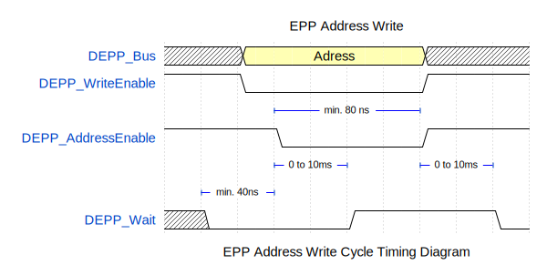
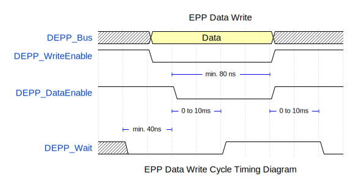
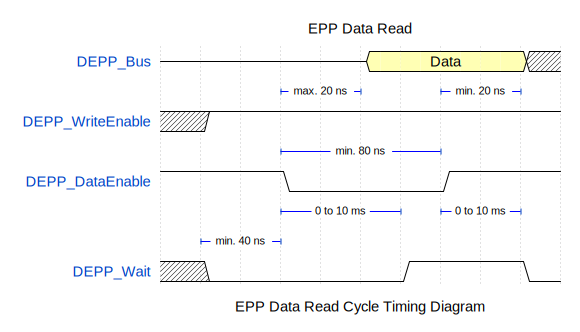
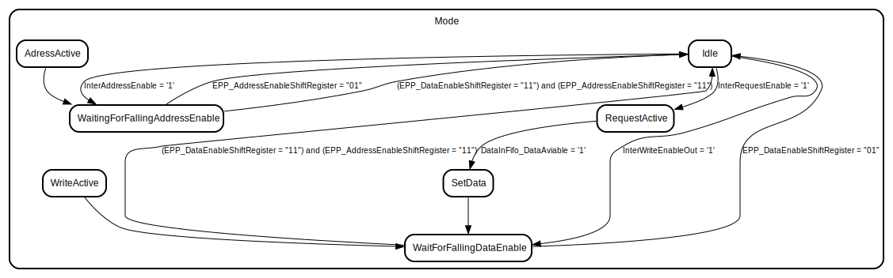

# Entity: DEPP

- **File**: DEPP.vhd

## Diagram

## Description

An EPP interface for Digilent FPGA boards
This interface is designed to be used with the Digilent EPP interface
and the Digilent Adept software.

**Measured data rate ≈ 4.68 kByte/s**

## Usage

The module is designed to be used with a FIFO interface.
Either the data & address (**write**) are transferred via the FIFO interface
**or** the requested address is transferred first and then the corresponding data is expected.

### Data Write:

With a data write request, the module transfers the **data** and the **address**
to the two corresponding FIFO interfaces.

### Data Read:

With a data read request, the module transfers the **requested address**
to the FIFO interface. It then expects the corresponding data
via the data input FIFO.

## History:

- 0.2.0 (2010.05.30) Initial version
- 0.3.0 (2024.03.06) Refactored and commented
- 0.3.1 (2024.03.09) Complet overhaul of the module
- 0.3.2 (2024.03.13) The forwarding of the address to be read to the FIFO is now implemented correctly.
  A usage description has been added. Documentation improved.

## Timing diagrams of the EPP bus

### EPP Address Write

### EPP Data Write

### EPP Data Read

## Ports

| Port name        | Direction | Type        | Description                                       |
| ---------------- | --------- | ----------- | ------------------------------------------------- |
| CLK              | in        | std_logic   | Clock signal Rising edge triggered                |
| CE               | in        | std_logic   | Chip enable `1` = enabled, `0` = disabled         |
| RST              | in        | std_logic   | Reset signal `1` = reset, `0` = normal operation  |
| EPP-Interface    | out       | Virtual bus | EPP Interface                                     |
| FIFO-Data-Out    | out       | Virtual bus | Data & Address Output. FIFO compatible interface  |
| FIFO-Data-In     | in        | Virtual bus | Data input. FIFO compatible interface             |
| FIFO-Address-Out | out       | Virtual bus | Request address output. FIFO compatible interface |

### Virtual Buses

#### EPP-Interface

| Port name          | Direction | Type                         | Description                                                                                                                                                |
| ------------------ | --------- | ---------------------------- | ---------------------------------------------------------------------------------------------------------------------------------------------------------- |
| DEPP_AddressEnable | in        | std_logic                    | Address strobe                                                                                                                                             |
| DEPP_DataEnable    | in        | std_logic                    | Data strobe                                                                                                                                                |
| DEPP_WriteEnable   | in        | std_logic                    | Transfer direction control  `1` = read (Host from DEPP); `0` = write (Host to DEPP)                                                                     |
| DEPP_Wait          | out       | std_logic                    | Handshake signal   `0` = ready for new cycle; `1` = closing current cycle and not ready for new cycle  Keep the signal low to delay the cycle length |
| DEPP_Bus           | inout     | std_logic_vector(7 downto 0) | Data/Adress bus; Tri-state                                                                                                                                 |

#### FIFO-Data-Out

| Port name               | Direction | Type                         | Description                                                             |
| ----------------------- | --------- | ---------------------------- | ----------------------------------------------------------------------- |
| DataOutFifo_Data        | out       | std_logic_vector(7 downto 0) | Data output corosponding to the address                                 |
| DataOutFifo_Address     | out       | std_logic_vector(7 downto 0) | Address output                                                          |
| DataOutFifo_WriteEnable | out       | std_logic                    | Valid data & adress output if `1`. Is only 1 cycle valid                |
| DataOutFifo_FullFlag    | in        | std_logic                    | If `1` the module delays the bus and dont rise the `WriteEnable` signal |

#### FIFO-Data-In

| Port name             | Direction | Type                         | Description                                             |
| --------------------- | --------- | ---------------------------- | ------------------------------------------------------- |
| DataInFifo_Data       | in        | std_logic_vector(7 downto 0) | Data input                                              |
| DataInFifo_EmptyFlag  | in        | std_logic                    | If the fifo is not empty, the module will read the data |
| DataInFifo_ReadEnable | out       | std_logic                    | Is one cycle `1` to indicate that the data is read      |

#### FIFO-Address-Out

| Port name                  | Direction | Type                         | Description                                                               |
| -------------------------- | --------- | ---------------------------- | ------------------------------------------------------------------------- |
| AddressOutFifo_Data        | out       | std_logic_vector(7 downto 0) | Address output for read requests                                          |
| AddressOutFifo_WriteEnable | out       | std_logic                    | Valid address output if `1`. Is only 1 cycle valid                        |
| AddressOutFifo_FullFlag    | in        | std_logic                    | If `1` the module delays the bus and dont rise the `RequestEnable` signal |

## Signals

| Name                           | Type                         | Description                                                                             |
| ------------------------------ | ---------------------------- | --------------------------------------------------------------------------------------- |
| TempAddressRegister            | std_logic_vector(7 downto 0) | Catch the address as long as the mode (read/write) has not yet been decided.            |
| EPP_AddressEnableShiftRegister | std_logic_vector(1 downto 0) | Shift register for the rising/falling edge detection of the `DEPP_AddressEnable` signal |
| EPP_DataEnableShiftRegister    | std_logic_vector(1 downto 0) | Shift register for the rising/falling edge detection of the `DEPP_DataEnable` signal    |
| Mode                           | ModeType                     | The current state of the main state machine                                             |
| InterWriteEnableOut            | std_logic                    | The output signals for the output data fifo; also controls the address fifo.            |
| InterRequestEnable             | std_logic                    | The output signals for the output address fifo                                          |
| InterAddressEnable             | std_logic                    | Intermediary signal to start the address write cycle                                    |
| DataInFifo_DataAviable         | std_logic                    | Negated `DataInFifo_EmptyFlag` signal                                                   |

## Types

| Name     | Type                                                                                                                                                                                                                                                                                                                                        | Description                          |
| -------- | ------------------------------------------------------------------------------------------------------------------------------------------------------------------------------------------------------------------------------------------------------------------------------------------------------------------------------------------- | ------------------------------------ |
| ModeType | (Idle,  RequestActive,  SetData,  WriteActive,  WaitForFallingDataEnable,  WaitingForFallingAddressEnable,  AdressActive) | The states of the main state machine |

## Processes

- EPP_AddressEnableCatch: ( CLK )
  - **Description**
    Shifts the value from the `DEPP_AddressEnable` signal into the `EPP_AddressEnableShiftRegister` for the rising/falling edge detection.
- EPP_DataEnableCatch: ( CLK )
  - **Description**
    Shifts the value from the `DEPP_DataEnable` signal into the `EPP_DataEnableShiftRegister`. for the rising/falling edge detection.
- DataInFIFOMinimizeLatency: ( Mode, DataInFifo_DataAviable )
  - **Description**
    Redirection of the `DataInFifo_EmptyFlag` signal to the `DataInFifo_ReadEnable` signal if in the `RequestActive` mode: Minimize the latency of the data read.
- EPP_WaitManagement: ( CLK )
- EPP_AddressCatch: ( CLK )
  - **Description**
    Address write cycle: If the `DEPP_AddressEnable` signal rises, he `DEPP_WriteEnable` signal is low and the module is in idle state the `DEPP_Bus` is stored in the `TempAddressRegister`.
- EPP_ReciveData: ( CLK )
  - **Description**
    Data write cycle: If the `DEPP_DataEnable` signal rises, the `DEPP_WriteEnable` signal is low and the module is in idle state the `DEPP_Bus` is stored in the `DataOut`, the `TempAddressRegister` is stored in the `AddressOut` and the `WriteEnableOut` signal is set to `1`.
- EPP_ReciveRequest: ( CLK )
  - **Description**
    Data read cycle: If the `DEPP_DataEnable` signal rises, the `DEPP_WriteEnable` signal is high (read) and the module is in idle state the `TempAddressRegister` is stored in the `RequestAddress` and the `RequestEnable` signal is set to `1`.

## State machines

